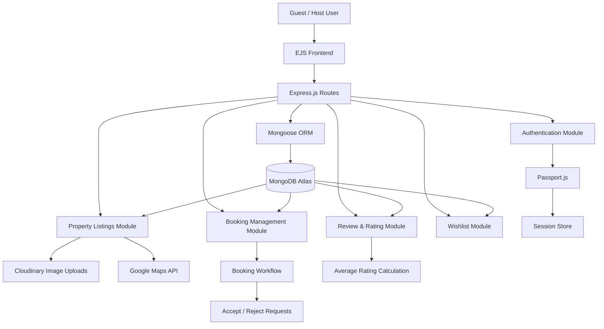

# 🏠 StayEase – Full Stack Property Listing & Booking Platform

A production-inspired full-stack property listing and booking platform built using Node.js, Express.js, MongoDB, and EJS.

The platform enables users to discover properties, manage listings, submit booking requests, review properties, and interact through a complete host–guest workflow. The application is designed following industry-standard MVC architecture and focuses on authentication, authorization, booking management, cloud integrations, and scalable backend development.

---

# 🚀 Live Demo

### 🌐 Live Application

https://airbnb-full-stack-project-e7eq.onrender.com/listings

### 📂 GitHub Repository

https://github.com/hariom-p1306/AirBnb-Full-Stack-Project-

> ⚠️ Note: Initial load may take a few seconds because the application is hosted on Render's free tier.

---

# ✨ Key Features

## 🔐 Authentication & Authorization

* Secure user registration and login
* Session-based authentication using Passport.js
* Password hashing and credential validation
* Protected routes for authenticated users
* Authorization middleware for resource ownership validation

---

## 🏠 Property Listing Management

* Create, update, and delete property listings
* Property categorization support
* Cloudinary-based image upload and management
* Detailed property information pages
* Responsive property cards and layouts

---

## 📅 Booking Management System

* Guest booking request workflow
* Host booking approval dashboard
* Booking acceptance and rejection system
* Dynamic booking status management
* Guest booking tracking dashboard

### Booking Flow

```text
Guest Request
       ↓
    Pending
       ↓
Host Accept / Reject
       ↓
Accepted / Rejected
```

---

## ⭐ Reviews & Ratings

* Property review system
* Individual user reviews
* Average rating calculation
* Review ownership protection
* Dynamic rating display

---

## 🔍 Search & Discovery

* Search properties by location
* Enhanced property browsing experience
* Fast property discovery workflow

---

## 🌎 Maps Integration

* Google Maps API integration
* Property location visualization
* Interactive map display

---

## 🎨 User Experience

* Responsive UI design
* Bootstrap-powered components
* Flash messages and notifications
* Client-side form validation
* Improved booking workflow

---

# 🛠 Tech Stack

## Frontend

* HTML5
* CSS3
* JavaScript
* EJS
* Bootstrap

## Backend

* Node.js
* Express.js
* MongoDB
* Mongoose

## Authentication

* Passport.js
* Express Session

## External Services

* Cloudinary
* Google Maps API

## Deployment

* Render
* MongoDB Atlas

---

# 🏗️ Architecture Diagram



---

# 🎯 System Design Highlights

* Implemented MVC Architecture for maintainable code organization.
* Designed role-based workflows separating Host and Guest functionalities.
* Established relationships using MongoDB references between Users, Listings, Reviews, and Bookings.
* Built secure session-based authentication using Passport.js.
* Integrated Cloudinary for scalable image storage and delivery.
* Added Google Maps integration for location visualization.
* Implemented booking approval workflows inspired by real-world rental platforms.
* Structured middleware for authorization, validation, and centralized error handling.

---

# 🧠 Software Architecture

The application follows the MVC (Model-View-Controller) architecture pattern.

### Models

* User
* Listing
* Booking
* Review

### Routes

* Listing Routes
* Authentication Routes
* Review Routes
* Booking Routes
* Wishlist Routes

### Middleware

* Authentication Middleware
* Authorization Middleware
* Validation Middleware
* Error Handling Middleware

### Utilities

* Async Error Wrappers
* Custom Error Classes
* Centralized Exception Handling

---

# 🔐 Security Features

* Password hashing and secure authentication
* Session-based login management
* Protected routes
* Resource ownership validation
* Input validation
* Centralized error handling
* Secure environment variable management

---

# 📁 Project Structure

```text
Airbnb/
│
├── controllers/
│
├── models/
│   ├── user.js
│   ├── listing.js
│   ├── booking.js
│   └── review.js
│
├── routes/
│   ├── listing.js
│   ├── booking.js
│   ├── review.js
│   ├── payment.js
│   ├── wishlist.js
│   └── user.js
│
├── middleware/
│
├── utils/
│
├── public/
│   ├── css/
│   └── js/
│
├── views/
│   ├── listings/
│   ├── bookings/
│   ├── users/
│   ├── layouts/
│   └── includes/
│
├── app.js
├── package.json
└── README.md
```

---

# ⚙️ Installation & Setup

Clone the repository:

```bash
git clone https://github.com/hariom-p1306/AirBnb-Full-Stack-Project-
```

Install dependencies:

```bash
npm install
```

Create a `.env` file:

```env
ATLASDB_URL=your_mongodb_connection_string

SECRET=your_session_secret

GOOGLE_MAPS_API_KEY=your_google_maps_api_key

CLOUDINARY_CLOUD_NAME=your_cloud_name

CLOUDINARY_KEY=your_cloudinary_key

CLOUDINARY_SECRET=your_cloudinary_secret
```

Run the application:

```bash
npm start
```

Open in browser:

```bash
http://localhost:8080
```

---

# 🎯 Learning Outcomes

* Applied MVC Architecture in a real-world project
* Built secure authentication and authorization systems
* Implemented complete booking workflow management
* Managed relational data using MongoDB references
* Integrated third-party APIs and cloud services
* Designed scalable backend structures
* Deployed and maintained a production-ready application

---

# 🚀 Future Enhancements

* Payment Gateway Integration
* Real-Time Notifications
* Email Confirmation System
* Property Availability Calendar
* Advanced Search Filters
* Booking Date Validation
* React Frontend Migration
* Admin Dashboard
* Recommendation System

---

# 👨‍💻 Author

### Hariom Patel

**Full Stack Developer**

* LinkedIn: https://www.linkedin.com/in/hariom-patel-dev
* Portfolio: https://portfolio-one-navy-20.vercel.app/

---

⭐ If you found this project interesting, consider giving it a star and sharing your feedback.
