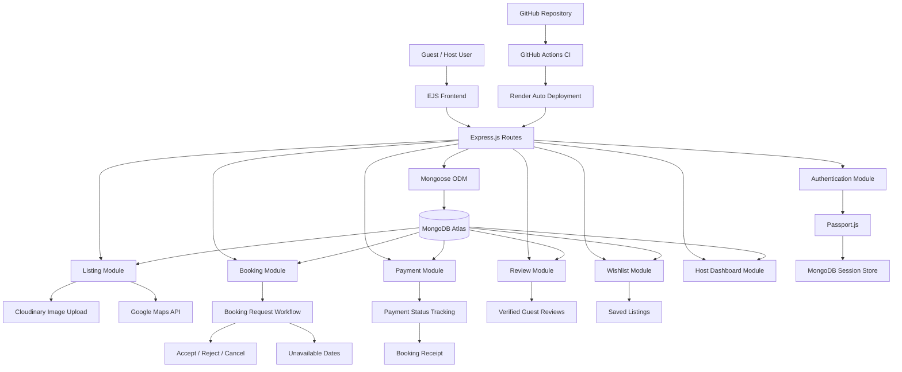

# 🏠 StayEase – Property Listing & Booking Platform

StayEase is a production-inspired full-stack property listing and booking platform built using **Node.js, Express.js, MongoDB, EJS, Passport.js, Cloudinary, Google Maps API, GitHub Actions, and Render**.

The platform allows users to explore properties, manage listings, save wishlist items, request bookings, complete dummy payments, generate booking receipts, and submit verified reviews after successful bookings. It also includes a host dashboard for managing listings, booking requests, revenue tracking, and guest interactions.

> This project follows the MVC architecture and focuses on real-world backend workflows, authentication, authorization, booking management, cloud storage, CI/CD workflow, and scalable full-stack development.

---

## 🚀 Live Demo

### 🌐 Live Application

https://airbnb-full-stack-project-e7eq.onrender.com/listings

### 📂 GitHub Repository

https://github.com/hariom-p1306/AirBnb-Full-Stack-Project-

> ⚠️ Note: The first load may take a few seconds because the app is deployed on Render's free tier.

---

## ✨ Key Features

### 🔐 Authentication & Authorization

* User signup and login
* Session-based authentication using Passport.js
* Password hashing using Passport Local Mongoose
* Protected routes for authenticated users
* Owner-only authorization for edit/delete operations
* Review author protection
* Secure session storage using MongoDB session store

---

### 🏠 Property Listing Management

* Create, view, update, and delete property listings
* Cloudinary image upload support
* Image preview before uploading
* Category-based listing organization
* Responsive listing cards and layouts
* Detailed listing page with image gallery, booking card, reviews, and map
* Owner-specific listing management page: **My Listings**

---

### 🔍 Advanced Search & Filtering

* Search listings by title, location, and country
* Filter listings by category
* Filter listings by minimum and maximum price
* Sort listings by price low-to-high and high-to-low
* Clean Airbnb-style filter UI

---

### ❤️ Wishlist / Saved Listings

* Users can save listings to wishlist
* Add/remove listings using heart icon
* User-specific wishlist page
* Persistent wishlist stored in MongoDB

---

### 📅 Booking Management System

* Guest booking request workflow
* Check-in and check-out date selection
* Booking date validation
* Past date booking prevention
* Booking conflict prevention for already accepted bookings
* Host accept/reject workflow
* Guest booking cancellation for pending requests
* Booking status tracking
* Unavailable dates display for confirmed bookings

#### Booking Flow

```text
Guest sends booking request
        ↓
Pending
        ↓
Host accepts or rejects
        ↓
Accepted / Rejected
        ↓
Payment
        ↓
Paid / Confirmed
```

---

### 💳 Payment & Receipt Flow

* Dummy payment gateway flow
* Payment status tracking: unpaid / paid
* Total nights calculation
* Total booking price calculation
* Payment success receipt page
* Printable booking receipt
* Booking ID generation on receipt

---

### 📊 Host Dashboard

* Host booking request dashboard
* Accept/reject booking requests
* Filter bookings by status:

  * All
  * Pending
  * Accepted
  * Rejected
  * Paid
* Host analytics cards:

  * Total listings
  * Total booking requests
  * Pending requests
  * Accepted bookings
  * Rejected bookings
  * Estimated revenue

---

### ⭐ Reviews & Ratings

* Users can review listings only after completing a paid booking
* Duplicate review prevention
* Review author validation
* Average rating calculation
* Verified Guest badge for paid guests
* Review delete protection

---

### 🌎 Google Maps Integration

* Google Maps API integration
* Property location map section
* Interactive map display on listing details page

---

### 🎨 User Experience Improvements

* Modern Airbnb-inspired UI
* Responsive navbar
* Premium listing cards
* Mobile-friendly filters
* Flash message notifications
* Form validation
* Empty states
* Booking status timeline
* Clean footer and layout structure
* Improved mobile responsiveness across major pages

---

### ⚙️ CI/CD & Deployment

* GitHub Actions CI workflow for dependency installation and basic code validation
* Render auto-deployment from GitHub repository
* Environment-based configuration using `.env`
* MongoDB Atlas for cloud database hosting

---

## 🛠 Tech Stack

### Frontend

* HTML5
* CSS3
* JavaScript
* EJS
* Bootstrap
* Font Awesome

### Backend

* Node.js
* Express.js
* MongoDB
* Mongoose

### Authentication

* Passport.js
* Passport Local Mongoose
* Express Session
* Connect Mongo

### Cloud & APIs

* Cloudinary
* Google Maps API
* MongoDB Atlas

### DevOps & Deployment

* Git
* GitHub
* GitHub Actions
* Render

---

## 🏗️ Architecture Diagram



---

## 🧠 System Design Highlights

* MVC architecture for maintainable code organization
* Separate models, routes, controllers, middleware, and views
* Role-based host and guest workflows
* MongoDB references between Users, Listings, Reviews, and Bookings
* Protected ownership-based operations
* Booking availability and conflict validation
* Payment status and receipt management
* Verified review workflow based on paid bookings
* Cloudinary-based scalable image handling
* MongoDB-backed session storage
* GitHub Actions CI workflow for automated project validation
* Render auto-deployment from GitHub
* Centralized error handling using custom error classes

---

## 📁 Project Structure

```text
Airbnb/
│
├── .github/
│   └── workflows/
│       └── node-ci.yml
│
├── controllers/
│   ├── listings.js
│   └── review.js
│
├── models/
│   ├── user.js
│   ├── listing.js
│   ├── booking.js
│   └── review.js
│
├── routes/
│   ├── listing.js
│   ├── user.js
│   ├── booking.js
│   ├── payment.js
│   ├── review.js
│   └── wishlist.js
│
├── public/
│   ├── css/
│   │   ├── style.css
│   │   └── rating.css
│   └── js/
│       └── script.js
│
├── views/
│   ├── listings/
│   ├── bookings/
│   ├── users/
│   ├── wishlist/
│   ├── layouts/
│   └── includes/
│
├── utils/
│   ├── ExpressError.js
│   └── wrapAsync.js
│
├── cloudConfig.js
├── middleware.js
├── schema.js
├── app.js
├── package.json
└── README.md
```

---

## ⚙️ Installation & Setup

### 1. Clone the repository

```bash
git clone https://github.com/hariom-p1306/AirBnb-Full-Stack-Project-
```

### 2. Move into the project folder

```bash
cd AirBnb-Full-Stack-Project-
```

### 3. Install dependencies

```bash
npm install
```

### 4. Create a `.env` file

```env
ATLASDB_URL=your_mongodb_atlas_connection_string
SECRET=your_session_secret

CLOUD_NAME=your_cloudinary_cloud_name
CLOUD_API_KEY=your_cloudinary_api_key
CLOUD_API_SECRET=your_cloudinary_api_secret

GOOGLE_MAPS_API_KEY=your_google_maps_api_key
NODE_ENV=development
```

> Do not push your `.env` file to GitHub.

### 5. Run the application

```bash
npm start
```

Or:

```bash
node app.js
```

### 6. Open in browser

```bash
http://localhost:8080
```

---

## 🔁 CI/CD Workflow

This project includes a basic GitHub Actions CI workflow.

```text
Code Push to GitHub
        ↓
GitHub Actions runs CI
        ↓
Install dependencies
        ↓
Validate project setup
        ↓
Render auto-deploys updated code
```

### CI Workflow Includes

* Repository checkout
* Node.js setup
* Dependency installation
* Basic code validation

---

## 🧪 Main User Flows

### Guest Flow

```text
Signup/Login
    ↓
Explore listings
    ↓
Search/filter listings
    ↓
Save wishlist
    ↓
Send booking request
    ↓
Make dummy payment
    ↓
View receipt
    ↓
Submit verified review
```

### Host Flow

```text
Login
    ↓
Create listing
    ↓
Manage listings
    ↓
View booking requests
    ↓
Accept/reject bookings
    ↓
Track revenue and booking stats
```

---

## 🔐 Security Features

* Password hashing
* Secure session-based authentication
* Protected routes
* Owner-only listing update/delete
* Review author validation
* Paid-booking-based review restriction
* Environment variable management
* Centralized error handling
* MongoDB session store

---

## 📌 Important Features Implemented

* Full authentication and authorization
* Listing CRUD
* Cloudinary image upload
* Image preview before upload
* Advanced search and price filters
* Wishlist system
* Booking request system
* Booking conflict validation
* Unavailable dates display
* Host booking dashboard
* Host analytics dashboard
* Payment status tracking
* Total price calculation based on nights
* Payment receipt page
* Printable receipt
* Verified guest reviews
* Review duplicate prevention
* My Listings page for hosts
* Responsive UI improvements
* GitHub Actions CI workflow
* Render auto-deployment

---

## 🚀 Future Enhancements

* Real payment gateway integration
* Email booking confirmation
* Real-time notifications
* Availability calendar UI
* Admin dashboard
* Property recommendation system
* React frontend migration
* Multi-image listing gallery
* Coupon and discount system

---

## 🎯 Learning Outcomes

* Built a full-stack MVC application from scratch
* Implemented secure authentication and authorization
* Designed real-world host and guest workflows
* Managed relational data using MongoDB references
* Integrated Cloudinary and Google Maps API
* Built booking conflict validation logic
* Implemented payment tracking and receipt generation
* Added GitHub Actions CI workflow
* Improved UI/UX with responsive design
* Deployed a full-stack application on Render

---

## 👨‍💻 Author

### Hariom Patel

**Full Stack Developer**

* LinkedIn: https://www.linkedin.com/in/hariom-patel-dev
* Portfolio: https://portfolio-one-navy-20.vercel.app/

---

## ⭐ Support

If you found this project useful or interesting, consider giving it a star on GitHub.
